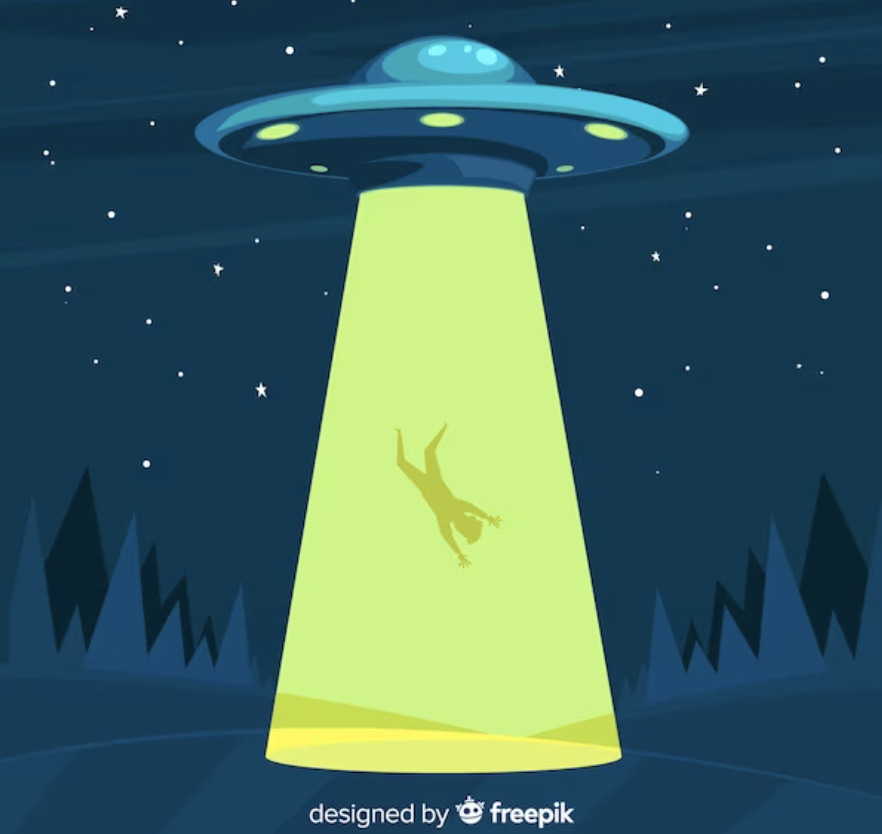

# Space Hangman Game

Welcome to the Space Hangman Game! This is a space-themed version of the classic hangman game, where instead of a man hanging, the player will be rescuing a person abducted by aliens. 

## Game Description

In this game, players are tasked with guessing a secret word by guessing individual letters. The secret word is represented by a series of underscores, with each underscore representing a letter in the word. The player needs to guess the correct letters to reveal the word and save the abducted person.

For each incorrect guess, the aliens would beam up the person. The player's goal is to guess the word correctly person is completely beamed up. If the peron is completely beamed up before the word is guessed, the game is lost.

## Features

- Space-themed visuals: The game features space-inspired graphics and animations, creating an immersive experience.
- Random word selection: A random word is selected for each round, ensuring a varied and challenging gameplay.
- Hint system: Players can use a limited number of hints to reveal a random letter in the word.
- High scores: The game keeps track of the highest score achieved by each player, encouraging competition and replayability.
- Responsive design: The game is designed to be fully responsive and can be played on different devices and screen sizes.

## Technologies Used

- HTML: Used for structuring the game interface and elements.
- CSS: Used for styling the game interface and creating visual effects.
- JavaScript: Used for implementing the game logic and interactivity.
- [Insert any additional technologies or libraries used]

## How to Play

1. Clone the repository or download the game files to your local machine.
2. Open the `index.html` file in your preferred web browser.
3. The game will start, and you will see a series of underscores representing the letters of the secret word.
4. Click or tap on the letters of the alphabet to make your guesses.
5. If the guessed letter is in the word, it will be revealed in its correct position(s).
6. If the guessed letter is not in the word, a part of the spaceship will be destroyed.
7. Keep guessing letters until you either guess the word correctly or the spaceship is fully destroyed.
8. Use hints wisely to reveal a random letter in the word and increase your chances of success.
9. Have fun and aim for the highest score!

## Future Updates

This project is open to future updates and improvements. Some possible features and enhancements that can be considered are:

- Multiplayer mode: Add the option for players to compete against each other in real-time.
- Sound effects: Incorporate sound effects and background music to enhance the gaming experience.
- Difficulty levels: Introduce different difficulty levels with varying word lengths or limited hints.
- Additional themes: Include more themes and variations, allowing players to choose their preferred setting.
